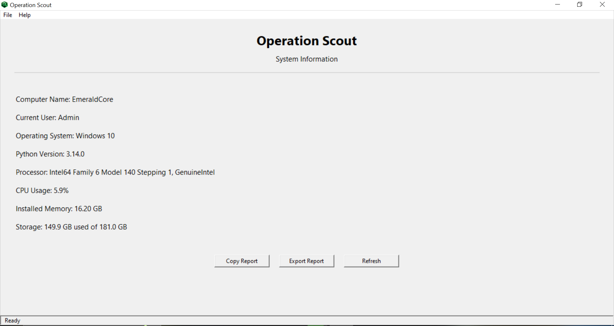

# Operation Scout

This executable file in written by me in Pyhton.
It displays the information about your computer Hardware and Software.
Just like the info page in Control Panel.

## Download
To run this on your computer download the executable file available up in the repository ---> Operation Scout.exe

## Screenshot


Above screenshot displays the features and working of the program.

## Buttons

### 1. Refresh
This button refresh(Updates) the information on the screen.
### 2. Export
This button exports the system stats and save them in a .txt file on the local storage.
### 3. Copy
This button copy the stat information to your clipboard.

## Project Structure

```
OperationScout/
│
├── app.py
├── README.md
├── requirements.txt
├── reports/
├── assets/
│   ├── icon.png
│   └── screenshot.png
└── scout/
    ├── report.py
    └── system.py
```
 
